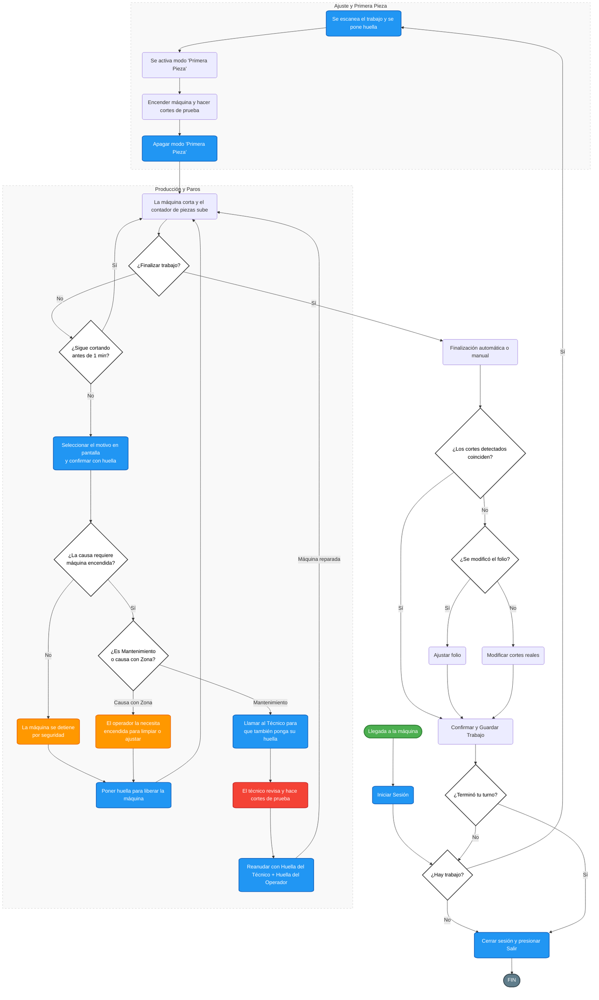

# Flujo del módulo de Inicio: del arranque al cierre de sesión

Diagrama único del módulo `InicioView` (`src/gui/inicio_view.py`), siguiendo toda la
recorrida real: arranque de la aplicación, cierre de sesión interrumpida, inicio de
sesión, espera de trabajo, carga de trabajo por QR, salida de Primera pieza,
producción, paros (los tres caminos), cierre de trabajo, decisión de "¿otro trabajo?",
cierre de sesión y salida de la aplicación.

Cada nodo referencia `archivo:línea` para poder trazarlo al código.

## Clave de estados

| Etiqueta | Significado |
|---|---|
| `SIN TRABAJO` | Sesión abierta, máquina detenida, sin folio cargado |
| `ESPERA TRABAJO` | Modo Primera pieza activo con la máquina **apagada**, esperando QR |
| `PRIMERA PIEZA` | Modo Primera pieza activo con la máquina **encendida** (cortes de setup, no cuentan) |
| `LISTA` | Produciendo: los cortes cuentan para el folio de la sesión |
| `EN PARO` | Paro detenido, todavía **no autorizado** (emergente, sin causa) |
| `PARO` / `PARO (EN MARCHA)` | Modo Paro autorizado; la máquina está detenida o sigue cortando según la zona |
| `MANTENIMIENTO` | Modo Mantenimiento: la máquina sigue cortando con el conteo suspendido |
| `EN ESPERA` | Sin sesión abierta |

## Diagrama de proceso manual

Vista operativa simplificada del mismo recorrido, pensada para revisar el ciclo de la
planta de un vistazo, sin entrar al detalle de cada rama del código.



### Diferencias entre el diagrama manual y el código

El diagrama manual es una simplificación operativa. Estos puntos sí difieren del
comportamiento real de `inicio_view.py`:

| Punto | Diagrama manual | Comportamiento real |
|---|---|---|
| Cuándo se enciende la máquina | `E → F` la enciende al activar Primera pieza | Al pulsar PLAY la máquina **sigue apagada**; se enciende en `_trabajo_cargado` (`inicio_view.py:2045`) al cargar el folio, para los cortes de setup |
| `I` ¿Sigue cortando antes de 1 min? | Un solo guard de 1 minuto | Son **dos** mecanismos distintos: seguro anti-corte `SEGURO_PARO_SEGUNDOS` = 3 s (`inicio_view.py:1605`) y auto-paro por inactividad `PARO_IDLE_TIMEOUT_S` = 60 s (`inicio_view.py:1579`) |
| `M_EstadoMaq` ¿La causa requiere máquina encendida? | Una sola condición | Son **dos**: la causa debe `requiere_zona` **y** esa zona tener marcada `maquina_encendida` en Administración → Zonas (`selector_causas.py:277`) |
| `N` Poner huella para liberar la máquina | Un solo camino desde ambos paros | Al salir de un paro con la máquina **detenida**, `reprisar_maquina()` la **enciende sola** (`inicio_view.py:1068`) |
| `C` ¿Hay trabajo? al iniciar sesión | Pregunta al iniciar sesión | La sesión se abre sin preguntar; el trabajo se pide después, al pulsar PLAY (`inicio_view.py:596`) |
| Autorización de `D` | Solo huella | El operador debe ser dueño de la sesión o tener `autorizar_supervision` (`inicio_view.py:1211`) |
| `G` Apagar Primera pieza | Solo huella | Pasados 900 s exige rol con `autorizar_paro`, incluso el dueño de la sesión (`inicio_view.py:1674`) |
| `R_Guardar` Confirmar y Guardar | El trabajo siempre queda guardado como cerrado | Solo queda **Cerrado** si alcanzó la meta; si no queda **Abierto** con su parcial, retomable escaneando su QR (`database.py` `cerrar_trabajo_modalidad`) |
| `T` Cerrar sesión y presionar Salir | Un solo paso | Cerrar sesión es **independiente** de salir de la app, y **no se puede cerrar sesión con la máquina en marcha** (`inicio_view.py:417`) |
| Cierre de trabajo | No contemplado | Al cerrar sesión el trabajo abierto **no se cierra**: queda `Abierto` (`inicio_view.py:2170`) |

## Diagrama detallado

```mermaid
flowchart TD

%% ============================================================
%% A · ARRANQUE
%% ============================================================
subgraph A["A · ARRANQUE"]
  A1["main.py:667 — QApplication y tema desde config.json"]
  A2["main.py:681 — init_db: crea y migra SQLite"]
  A3["main.py:115 — BiometricService: carga SDK DigitalPersona"]
  A4{"main.py:87 — MODBUS_HOST definido?"}
  A5["ModbusController — HAL real, modulo Advantech WISE-4060LAN"]
  A6["SimulacionController — HAL simulado, sin hardware"]
  A7["main.py:546 — mostrar_vista crea el InicioView (una sola vez)"]
  A8["inicio_view.py:227 — _crear_interfaz, _cerrar_sesion_interrumpida, _refrescar_contador, _checkpoint_cortes"]
  A9["modbus_controller.py:190 — latch PAUSE: la maquina arranca DETENIDA"]
  A10["main.py:689 — splash finish, ventana en pantalla completa (kiosko)"]
  A1 --> A2 --> A3 --> A4
  A4 -->|"si"| A5
  A4 -->|"no"| A6
  A5 --> A7
  A6 --> A7
  A7 --> A8 --> A9 --> A10
end

%% ============================================================
%% B · SESION INTERRUMPIDA (apagon, crash, cierre de ventana)
%% ============================================================
subgraph B["B · SESION INTERRUMPIDA — solo si habia sesion Activa"]
  B0{"inicio_view.py:809 — obtener_sesion_interrumpida devuelve algo?"}
  B1["inicio_view.py:829 — guardar el folio ANTES de cerrar el trabajo"]
  B2["confirmar_trabajo_por_apagon — se CONFIRMA lo del checkpoint de 30 s"]
  B3{"La cantidad confirmada alcanza la meta?"}
  B4["Trabajo queda CERRADO"]
  B5["Trabajo queda ABIERTO con su parcial — se retoma escaneando su QR"]
  B6{"inicio_view.py:849 — hay fila de paro en curso?"}
  B7["finalizar_paro con causa implicita Computadora apagada"]
  B8["_reconstruir_paro_apagon :903 — medir desde ultimo_corte hasta el reinicio, no desde el reinicio"]
  B9["database.py:1251 — cerrar_sesion: estado Finalizada con el total del checkpoint"]
  B10["La vista queda SIN sesion: el operador entra con huella nueva, contador en 0"]
  B0 -->|"no"| C0
  B0 -->|"si"| B1 --> B2 --> B3
  B3 -->|"si"| B4 --> B6
  B3 -->|"no"| B5 --> B6
  B6 -->|"si"| B7 --> B9
  B6 -->|"no, la maquina CORRIA"| B8 --> B9
  B9 --> B10 --> C0
end

%% ============================================================
%% C · INICIAR SESION
%% ============================================================
subgraph C["C · INICIAR SESION"]
  C0["main.py:249 — el boton del header delega en InicioView.toggle_sesion"]
  C1{"inicio_view.py:414 — hay sesion abierta?"}
  C2["_abrir_huella_sesion :429 — HuellaModal INICIAR SESION"]
  C3{"biometric_service.py:136 — autenticar_operador"}
  C4["obtener_operador_temporal — Operador Temporal dev"]
  C5["RuntimeError: driver de DigitalPersona no instalado"]
  C6["biometric_service.py:123 — capturar y comparar FMDs con los operadores activos"]
  C7{"Huella reconocida bajo el umbral?"}
  C8["huella_modal.py:596 — beep y reintento automatico a 2.5 s"]
  C9["inicio_view.py:461 — _sesion_abierta"]
  C10["database.py:1236 — abrir_sesion: se crea la fila estado Activa"]
  C11["controlador.reset_conteo — el TOTAL de produccion es POR SESION"]
  C12["_refrescar_operador — emite sesion_cambiada: el header pinta nombre e icono persona o engranaje"]
  C1 -->|"no"| C2
  C2 --> C3
  C3 -->|"MODO_DEV"| C4
  C3 -->|"no hay FMDs activos"| C4
  C3 -->|"SDK no disponible"| C5
  C3 -->|"lector listo"| C6 --> C7
  C7 -->|"no"| C8 --> C6
  C7 -->|"si"| C9
  C5 --> C2
  C4 --> C9
  C9 --> C10 --> C11 --> C12 --> D0
end

%% ============================================================
%% D · ESPERAR TRABAJO
%% ============================================================
subgraph D["D · ESPERAR TRABAJO"]
  D0{"inicio_view.py:1840 — aplica _abrir_espera_trabajo? sesion abierta, sin folio, maquina detenida, fuera de Primera pieza y Mantenimiento, sin ningun paro en curso"}
  D1["iniciar_paro — paro implicito Esperando trabajo, SIN huella extra"]
  D2["_toggle_maquina :561 — el operador pulsa PLAY"]
  D3{"Hay sesion abierta?"}
  D4["Mensaje: inicia sesion antes de encender la maquina"]
  D5{"Hay un modo especial o un paro sin autorizar?"}
  D6{"La maquina esta en marcha?"}
  D7["_encender_maquina :596"]
  D8["_entrar_primera_pieza :1883 — cierra el paro de espera, atribuido al operador"]
  D9["iniciar_paro con causa fija Primera pieza"]
  D10["suspender_conteo — los cortes van a EXCLUIDOS, es decir piezas de setup"]
  D11["Estado ESPERA TRABAJO: la maquina sigue FISICAMENTE APAGADA"]
  D0 -->|"si"| D1 --> D2
  D0 -->|"no"| D2
  D2 --> D3
  D3 -->|"no"| D4 --> C1
  D3 -->|"si"| D5
  D5 -->|"modo Mantenimiento"| H_M_SALIR
  D5 -->|"modo Paro"| H_P_SALIR
  D5 -->|"paro NO autorizado"| H_NOAUT
  D5 -->|"ninguno"| D6
  D6 -->|"no, detenida"| D7
  D6 -->|"si"| G0
  D7 --> D8 --> D9 --> D10 --> D11 --> E0
end

%% ============================================================
%% E · CARGAR TRABAJO POR QR
%% ============================================================
subgraph E["E · CARGAR TRABAJO — QR folio num_part cantidad_total"]
  E0["_abrir_modal_trabajo :1928 — HuellaModal TRABAJO NUEVO"]
  E1["huella_modal.py:82 — parsear_qr, separador ESTRICTO, solo_pipe"]
  E2{"Resultado del modal"}
  E3{"_cancelar_modal_trabajo :1977 — el operador cancela o el QR va vacio"}
  E4{"_tiene_permiso_iniciar_primera_pieza :1969"}
  E5["Se mantiene Primera pieza SIN trabajo — permitidos: Mantenimiento y Admin"]
  E6["Se cierra el modo, maquina detenida, y se abre el paro de espera"]
  E7{"_validar_autorizacion_paro :1211 — dueno de la sesion o rol con autorizar_supervision"}
  E8["database.py:1344 — abrir_trabajo"]
  E9{"Estado previo del folio"}
  E10["RECHAZADO: el folio ya estaba Cerrado — mensaje y el modal se reabre"]
  E11["RETOMA: se revincula a esta sesion, conserva detectados y confirmados, limpia fecha_fin"]
  E12["Folio NUEVO: se crea con detectados 0 y confirmados 0"]
  E13["_trabajo_cargado :2009 — fija el baseline: el conteo del trabajo es total menos baseline"]
  E14{"La maquina esta detenida?"}
  E15["maquina_lista — ENCIENDE la maquina para los cortes de setup"]
  E16["Sigue en Primera pieza: el conteo del folio AUN no arranca"]
  E0 --> E1 --> E2
  E2 -->|"QR invalido"| E0
  E2 -->|"Cancelar o vacio"| E3
  E3 -->|"si, con permiso"| E5 --> F0
  E3 -->|"no"| E6 --> D0
  E2 -->|"QR valido"| E7
  E7 -->|"rechazado"| E0
  E7 -->|"autorizado"| E8 --> E9
  E9 -->|"Cerrado"| E10 --> E0
  E9 -->|"Abierto"| E11 --> E13
  E9 -->|"no existia"| E12 --> E13
  E13 --> E14
  E14 -->|"si"| E15 --> E16
  E14 -->|"no"| E16 --> F0
end

%% ============================================================
%% F · SALIR DE PRIMERA PIEZA
%% ============================================================
subgraph F["F · SALIR DE PRIMERA PIEZA — empieza a contar"]
  F0["_switch_primera_pieza :1625 — el operador apaga el switch"]
  F1{"Hay un trabajo cargado en PRODUCCION y se intenta ENCENDER el switch?"}
  F2["BLOQUEADO: usa el boton de maquina para guardar el trabajo y detener"]
  F3["_abrir_huella_primera_pieza :1689 — HuellaModal FINALIZAR PRIMERA PIEZA"]
  F4{"_timeout_primera_pieza_superado : mas de 900 s en el modo?"}
  F5{"Validador: fuera del timeout basta _validar_autorizacion_paro :1211"}
  F6{"Validador: pasado el timeout exige rol con permiso autorizar_paro"}
  F7["Rechazado — el switch vuelve a su estado real y se reintenta"]
  F8["_primera_pieza_finalizada :1749"]
  F9["_finalizar_primera_pieza_si_activa — cierra el paro Primera pieza y RETOMA el conteo, reinicia la gracia de inactividad"]
  F10{"Hay un trabajo cargado?"}
  F11["recortar_inicio_segmento — el conteo del folio ARRANCA y la maquina sigue en marcha produciendo"]
  F12["maquina_pausada — sin trabajo la maquina se APAGA al salir del modo"]
  F0 --> F1
  F1 -->|"si"| F2 --> F0
  F1 -->|"no"| F3 --> F4
  F4 -->|"no"| F5
  F4 -->|"si"| F6
  F5 -->|"no"| F7 --> F3
  F6 -->|"no"| F7
  F5 -->|"si"| F8
  F6 -->|"si"| F8
  F8 --> F9 --> F10
  F10 -->|"si"| F11 --> G0
  F10 -->|"no"| F12 --> D0
end

%% ============================================================
%% G · PRODUCCION
%% ============================================================
subgraph G["G · PRODUCCION — estado Maquina LISTA"]
  G0["Los cortes del HAL se acumulan y cuentan para el folio de la sesion"]
  G1{"_verificar_meta_trabajo :2134 — confirmados globales mas lo cortado en esta sesion alcanza cantidad_total?"}
  G2{"_verificar_inactividad :1579 — el menor de segundos sin corte y segundos desde arranque es mayor o igual a 60 s?"}
  G3["_pausar_maquina :1094 con motivo automatico — iniciar_paro con `inicio_hace_s`=ancla: `inicio_paro` retrotrae al ultimo corte o a la salida del ultimo evento (el minuto muerto cuenta)"]
  G0 --> G1
  G1 -->|"no"| G2
  G2 -->|"si"| G3 --> H0
  G2 -->|"no"| G0
  G1 -->|"si"| I0
end

%% ============================================================
%% H · PAROS
%% ============================================================
subgraph H["H · PAROS"]
  H0["_boton_paro :974 — el operador pulsa PARO"]
  H1{"Hay un modo especial activo?"}
  H2{"La maquina esta en marcha?"}
  H3{"_seguro_paro_segundos :1611 — hubo un corte REAL en los ultimos 3 s?"}
  H4["BLOQUEADO por seguro anti-corte: la maquina esta cortando, espera unos segundos"]
  H5{"_en_paro con paro NO autorizado?"}
  H6["Reabrir la autorizacion del paro pendiente — el unico camino de salida"]
  H7["Sin efecto: la maquina ya esta detenida y no hay paro pendiente"]
  H8["_pausar_maquina :1094"]
  H9["maquina_pausada — latch PAUSE sostenido en el rele"]
  H10["iniciar_paro con el folio activo — fila EN CURSO, todavia SIN causa"]
  H11["_abrir_paro_autorizacion :1103 — Modal AUTORIZACION DEL PARO, no cancelable"]
  H12{"Hay causas de paro configuradas?"}
  H13["Aviso: no hay causas, ve a Administracion — la maquina queda detenida"]
  H14{"selector_causas.py:240 — causa seleccionada"}
  H15{"La causa REQUIERE zona? selector_causas.py:229"}
  H16{"La zona tiene marcada maquina_encendida? selector_causas.py:277"}
  H_NOAUT["Paro EMERGENTE: maquina detenida, sin causa, sin huella. Solo sale autorizando o cerrando sesion"]

  H_ENC["reprisar_maquina — la maquina sigue CORRIENDO"]
  H_ENC2["suspender_conteo — los cortes van a EXCLUIDOS, no cuentan"]
  H_ENC3["_autorizado_autenticado :1225 — modo PARO armado, el paro queda ABIERTO en BD"]
  H_ENC4["Huella 2 — SALIR DE PARO, el operador reanuda"]
  H_ENC5["_modo_paro_finalizado :1042 — finalizar_paro con causa y zona"]
  H_ENC6["retomar_conteo — el conteo vuelve a la sesion"]

  H_DET["La maquina se queda DETENIDA donde la paro la dejo"]
  H_DET2["_autorizado_autenticado :1225 — modo PARO armado"]
  H_DET3["Huella 2 — SALIR DE PARO"]
  H_DET4["_modo_paro_finalizado :1042 — finalizar_paro con causa y zona, reinicia la gracia de inactividad"]
  H_DET5{"Primera pieza sigue activa?"}
  H_DET6["suspender_conteo — el conteo lo mantiene suspendido el modo Primera pieza"]
  H_DET7["retomar_conteo — el conteo vuelve a la sesion"]
  H_DET8["reprisar_maquina — la maquina se ENCIENDE sola al salir del paro"]

  H_M1{"_es_causa_mantenimiento :1269 — la causa es mantenimiento?"}
  H_M2["Huella 1 — personal de MANTENIMIENTO, permiso autorizar_mantenimiento"]
  H_M3{"Valida el personal de mantenimiento?"}
  H_M4["Rechazado — se reintenta"]
  H_M5["Huella 2 — el OPERADOR reanuda, titulo AUTORIZACION OPERADOR"]
  H_M6{"_validar_autorizacion_paro — dueno o rol con autorizar_supervision"}
  H_M7["_modo_mantenimiento_iniciado :1339 — se vacia el flag de paro pendiente"]
  H_M8["reprisar_maquina — la maquina sigue EN MARCHA"]
  H_M9["suspender_conteo — cortes a EXCLUIDOS, misma logica de rafagas que Primera pieza"]
  H_M10["Modo MANTENIMIENTO activo: el paro abierto queda como paro del modo, con causa fija al salir"]
  H_M_SALIR["_salir_modo_mantenimiento :1370 — DOBLE validacion de salida"]
  H_M11["Huella 1 — REANUDACION MANTENIMIENTO"]
  H_M12["Huella 2 — REANUDACION OPERADOR"]
  H_M13["_mantenimiento_finalizado :1398"]
  H_M14["_finalizar_modo_mantenimiento — finalizar_paro con causa fija mantenimiento"]
  H_M15["incorporar igual a False — los cortes del modo se DESCARTAN"]
  H_M16["retomar_conteo y reinicio de la gracia de inactividad"]

  H_P_SALIR["_salir_modo_paro :1017 — segundo paso, pide huella del operador"]
  H_P_SALIR --> H_ENC4
  H_NOAUT --> H11

  H0 --> H1
  H1 -->|"modo Mantenimiento"| H_M_SALIR
  H1 -->|"modo Paro"| H_P_SALIR
  H1 -->|"modo Primera pieza"| H2
  H1 -->|"ninguno"| H2
  H2 -->|"no"| H5
  H2 -->|"si"| H3
  H3 -->|"si"| H4 --> G0
  H3 -->|"no"| H8 --> H9 --> H10 --> H11
  H5 -->|"si"| H6 --> H11
  H5 -->|"no"| H7
  H11 --> H12
  H12 -->|"no"| H13
  H12 -->|"si"| H14 --> H15
  H15 -->|"no — causa sin zona"| H14b{"Autorizar con huella del operador"}
  H15 -->|"si"| H16
  H14b -->|"si"| H_ENC
  H14b -->|"no"| H_DET
  H16 -->|"SI, maquina encendida"| H_ENC
  H16 -->|"NO"| H_DET
  H14 --> H_M1
  H_M1 -->|"si"| H_M2 --> H_M3
  H_M3 -->|"no"| H_M4 --> H_M2
  H_M3 -->|"si"| H_M5 --> H_M6
  H_M6 -->|"no"| H_M5
  H_M6 -->|"si"| H_M7 --> H_M8 --> H_M9 --> H_M10
  H_ENC --> H_ENC2 --> H_ENC3 --> H_ENC4 --> H_ENC5 --> H_ENC6 --> G0
  H_DET --> H_DET2 --> H_DET3 --> H_DET4 --> H_DET5
  H_DET5 -->|"si"| H_DET6 --> H_DET8
  H_DET5 -->|"no"| H_DET7 --> H_DET8
  H_DET8 --> G0
  H_M_SALIR --> H_M11 --> H_M12 --> H_M13 --> H_M14 --> H_M15 --> H_M16 --> G0
  H_M10 --> G0
end

%% ============================================================
%% H2 · PAROS IMPLICITOS
%% ============================================================
subgraph HB["H2 · PAROS IMPLICITOS — no se eligen a mano"]
  HI0["database.py:84 — el selector oculta 'primera pieza' y 'computadora apagada' porque las pone y quita el sistema"]
  HI1["ESPERANDO TRABAJO — se abre al iniciar sesion, al detener sin folio y tras un cierre; se cierra al escanear un QR o pulsar PLAY; se cierra sin huella"]
  HI2["PRIMERA PIEZA — causa fija, se cierra al salir del modo y DESCARTA sus cortes como piezas de setup"]
  HI3["COMPUTADORA APAGADA — solo al reiniciar tras un apagon; cierra el paro que quedo en curso"]
  HI0 --> HI1
  HI0 --> HI2
  HI0 --> HI3
end

%% ============================================================
%% I · FINALIZAR TRABAJO
%% ============================================================
subgraph I["I · FINALIZAR TRABAJO"]
  I0["_abrir_cierre_con_modalidad :643 — la confirmacion de la cantidad ES la autorizacion, NO se pide huella"]
  I1{"Origen del cierre"}
  I2["_verificar_meta_trabajo, disparo automatico del timer, NO cancelable"]
  I3["_apagar_maquina_en_marcha :615 — pulsacion del boton de maquina, cancelable"]
  I4["ModalidadCierreDialog — input precargado con lo cortado en ESTA sesion, editable"]
  I5{"Accion del operador"}
  I6["Cancelar, solo en el cierre manual — el trabajo sigue abierto y la maquina sigue contando"]
  I7["GUARDAR — modalidad parcial, se guarda el input tal cual"]
  I8["FOLIO MODIFICADO — se pide el nuevo total, mayor o igual a 1, y se guarda el menor entre input y nuevo total"]
  I9["_cerrar_trabajo_confirmado :687"]
  I10["cortes_detectados se toma del conteo vivo ANTES de detener"]
  I11["maquina_pausada, finalizar Primera pieza y switch OFF"]
  I12["database.py — cerrar_trabajo_modalidad guarda confirmados y detected"]
  I13{"La cantidad confirmada alcanza la meta?"}
  I14["Trabajo CERRADO"]
  I15["Trabajo ABIERTO con su parcial — NO se puede reabrir un Cerrado"]
  I16{"El cierre fue por meta?"}
  I17["Alarma de fin de trabajo y mensaje: pulsa PLAY para cargar el siguiente"]
  I18["Mensaje: trabajo guardado y maquina detenida — la SESION sigue abierta"]
  I0 --> I1
  I1 -->|"por meta"| I2 --> I4
  I1 -->|"manual"| I3 --> I4
  I4 --> I5
  I5 -->|"Cancelar"| I6 --> G0
  I5 -->|"GUARDAR"| I7 --> I9
  I5 -->|"FOLIO MODIFICADO"| I8 --> I9
  I9 --> I10 --> I11 --> I12 --> I13
  I13 -->|"si"| I14 --> I16
  I13 -->|"no"| I15 --> I16
  I16 -->|"si"| I17 --> J0
  I16 -->|"no"| I18 --> J0
end

%% ============================================================
%% J · DECISION
%% ============================================================
subgraph J["J · HAY OTRO TRABAJO"]
  J0{"El operador escanea otro QR o pulsa PLAY?"}
  J1["abre el paro de espera — el hueco entre trabajos queda medido"]
  J0 -->|"si"| J1 --> D2
  J0 -->|"no"| K0
end

%% ============================================================
%% K · CERRAR SESION
%% ============================================================
subgraph K["K · CERRAR SESION"]
  K0["_toggle_maquina seguido del boton de sesion del header, o el propio boton — toggle_sesion :404"]
  K1{"Hay un modal abierto?"}
  K2{"La maquina esta en marcha?"}
  K3["BLOQUEADO: una maquina encendida siempre vive dentro de una sesion; deténla con el boton de maquina"]
  K4["_abrir_huella_cierre :946 — HuellaModal CERRAR SESION"]
  K5{"_validar_autorizacion_paro :1211 — dueno de la sesion o rol con autorizar_supervision"}
  K6["Rechazado — se reintenta la huella"]
  K7["_cierre_autenticado :964 — _apagar_maquina :483"]
  K8{"_seguro_paro_segundos — hubo corte REAL en los ultimos 3 s?"}
  K9["BLOQUEADO por seguro anti-corte"]
  K10["maquina_pausada, camino defensivo: el guard de toggle_sesion ya lo habria bloqueado"]
  K11["total = controlador.cortes_totales — se lee ANTES de limpiar estado; el reset del contador vive en la apertura de sesion"]
  K12["_finalizar_primera_pieza_si_activa — descarta los cortes de setup"]
  K13["_cerrar_trabajo_por_cierre_sesion :2170 — pausar_trabajo con el parcial real"]
  K14["El trabajo NO se cierra: solo la meta lo cierra. Queda ABIERTO y se retoma escaneando su QR en otra sesion"]
  K15{"Queda un paro en curso?"}
  K16["finalizar_paro con causa y zona si estaba en modo Paro, o SIN causa si no se autorizo — dentro de try except para no frenar el cierre"]
  K17["_cerrar_espera_trabajo — cierra el paro Esperando trabajo con su causa, atribuida a quien autentico"]
  K18["database.py:1251 — cerrar_sesion: estado Finalizada con el total leido"]
  K19["Reset de TODOS los flags de modo, switch OFF y _refrescar_operador"]
  K20["El header vuelve a mostrar Iniciar sesion — el ciclo se reinicia"]
  K0 --> K1
  K1 -->|"si"| K0
  K1 -->|"no"| K2
  K2 -->|"si"| K3 --> K0
  K2 -->|"no"| K4 --> K5
  K5 -->|"no"| K6 --> K4
  K5 -->|"si"| K7 --> K8
  K8 -->|"si"| K9
  K8 -->|"no"| K10 --> K11 --> K12 --> K13 --> K14 --> K15
  K15 -->|"si"| K16 --> K17
  K15 -->|"no"| K17
  K17 --> K18 --> K19 --> K20 --> C0
end

%% ============================================================
%% L · SALIR DE LA APLICACION
%% ============================================================
subgraph L["L · SALIR DE LA APLICACION"]
  L0["Sidebar Salir, o cierre de la ventana (tambien Alt F4)"]
  L1{"main.py:582 — aplicacion_puede_cerrarse :751 — la maquina esta en marcha?"}
  L2["BLOQUEADO: detén la maquina con PARO antes de cerrar el programa"]
  L3["controlador.cleanup — deja el coil PAUSE latcheado en paro sostenido"]
  L4["La sesion queda Activa: al arrancar se recupera por el camino B, como un corte de luz"]
  L5["app.exec termina y el bloque finally libera el HAL"]
  L0 --> L1
  L1 -->|"si"| L2 --> L0
  L1 -->|"no"| L3 --> L4 --> L5
end

%% ============================================================
%% M · PROCESOS DE FONDO
%% ============================================================
subgraph M["M · PROCESOS DE FONDO"]
  M0["inicio_view.py:1455 — timer de 100 ms"]
  M1["_verificar_rafaga_arranque, _verificar_meta_trabajo, _refrescar_estado_maquina, _verificar_inactividad, _verificar_timeout_primera_pieza, _refrescar_labels_cortes"]
  M2["inicio_view.py:1527 — timer de checkpoint de 30 s"]
  M3["actualizar_cortes_sesion, registrar_ultimo_corte y actualizar_detectados — respaldo ante apagones"]
  M4["main.py:142 — timer de avisos de 3 s"]
  M5["biometria no disponible, lector desconectado del USB, HAL en simulacion, Modbus sin comunicacion, sin operadores registrados"]
  M6["HAL — el CONTADOR DE CORTES vive en el modulo Modbus por flancos; Windows solo lo lee"]
  M7["Seguro anti-corrida — _verificar_rafaga_arranque :2192, solo con conteo suspendido"]
  M8{"Mas de 5 cortes excluidos en los ultimos 7 s?"}
  M9["Alarma y pregunta: ya empezo a correr la maquina? :2275"]
  M10{"Respuesta del operador"}
  M11["No — corrida descartada, los cortes siguen fuera del conteo y se pierden al salir del modo"]
  M12["Si — huella del operador; en Mantenimiento es doble, primero mantenimiento y luego operador"]
  M13["_cerrar_primera_pieza con incorporar igual a True :2368"]
  M14["_corrida_confirmada_mantenimiento :2345"]
  M15["Solo se incorporan los cortes de la ventana detectada y posteriores"]
  M16["Los excluidos previos a la ventana se descartan como PIEZAS DE PRUEBA"]
  M17["La corrida confirmada FINALIZA el modo"]
  M18["_verificar_timeout_primera_pieza — aviso informativo una sola vez al superar los 900 s"]
  M0 --> M1
  M2 --> M3
  M4 --> M5
  M7 --> M8
  M8 -->|"no"| M7
  M8 -->|"si"| M9 --> M10
  M10 -->|"No"| M11
  M10 -->|"Si"| M12
  M12 --> M13 --> M15 --> M17
  M12 --> M14 --> M15
  M15 --> M16
  M1 --> M18
  M0 -.->|"dispara el auto-paro"| G2
  M1 -.->|"detecta la meta"| G1
  M3 -.->|"respaldo del corte de luz"| B2
  M7 -.->|"vigila Primera pieza"| F0
  M7 -.->|"nunca se suprime en Mantenimiento"| H_M10
end

%% ============================================================
%% CLASES
%% ============================================================
classDef paroOn fill:#1f4e79,stroke:#5b9bd5,color:#ffffff
classDef paroOff fill:#4a3f6b,stroke:#9c8fd0,color:#ffffff
classDef paroMant fill:#7a4b12,stroke:#e0a458,color:#ffffff
classDef bloqueo fill:#7a1f1f,stroke:#e05252,color:#ffffff
classDef cierre fill:#1f5c3a,stroke:#4fbf8b,color:#ffffff
classDef oculto fill:#3a3a3a,stroke:#767676,color:#ffffff
classDef decision fill:#f4f4f4,stroke:#595959,color:#000000

class H_ENC,H_ENC2,H_ENC3,H_ENC4,H_ENC5,H_ENC6,H_P_SALIR paroOn
class H_DET,H_DET2,H_DET3,H_DET4,H_DET5,H_DET6,H_DET7,H_DET8 paroOff
class H_M1,H_M2,H_M3,H_M4,H_M5,H_M6,H_M7,H_M8,H_M9,H_M10,H_M11,H_M12,H_M13,H_M14,H_M15,H_M16,H_M_SALIR paroMant
class H_NOAUT,H4,H6,H7,H9,K3,K9,F2,L2 bloqueo
class K4,K7,K18,K19,K20,L3,L4 cierre
class HI0,HI1,HI2,HI3,M0,M1,M2,M3,M4,M5,M6,M7,M8,M9,M10,M11,M12,M13,M14,M15,M16,M17,M18 oculto
class A4,B0,B3,B6,C1,C3,C7,D0,D3,D5,D6,E2,E4,E7,E9,E14,F1,F4,F5,F6,F10,G1,G2,H1,H2,H3,H5,H12,H14,H14b,H15,H16,I1,I5,I13,I16,J0,K1,K2,K5,K8,K15,L1 decision
```

## Guards y decisiones críticas

| Guard | Ubicación | Efecto |
|---|---|---|
| `_modal_abierto` | `inicio_view.py:412`, `:562`, `:978` | Bloquea cualquier acción mientras hay un modal en curso; evita que el timer reabra otro modal encima |
| Sesión abierta | `inicio_view.py:564` | Sin sesión no se enciende la máquina |
| Máquina en marcha al cerrar sesión | `inicio_view.py:417` | Bloquea el cierre de sesión; también bloquea el de la app (`:766`) |
| Seguro anti-corte `SEGURO_PARO_SEGUNDOS` (3 s) | `inicio_view.py:1605` | Bloquea PARO y apagado mientras la máquina sigue cortando |
| `_seguro_paro_segundos` al cerrar sesión | `inicio_view.py:492` | Camino defensivo, el guard del header ya lo bloqueó |
| Sin sesión para el botón PARO | `inicio_view.py:975` | Pide arrancar antes |
| Paro no autorizado | `inicio_view.py:569` | El botón de máquina queda inerte; la salida es autorizar por el botón PARO |
| Sin folio cargado en PLAY | `inicio_view.py:2162` | No permite escanear otro trabajo mientras uno esté abierto |
| Causa `requiere_zona` sin zona | `selector_causas.py:258` | `puede_confirmar` es False hasta elegir zona |
| Sin causas de paro configuradas | `inicio_view.py:1105` | Avisa y deja la máquina detenida |
| Sin causa "Primera pieza" | `inicio_view.py:1690` | El modo Primera pieza no está disponible |
| `PRIMERA_PIEZA_TIMEOUT_S` (900 s) | `inicio_view.py:1682` | La salida exige rol con `autorizar_paro`, incluso al dueño de la sesión |
| Cierre por meta no cancelable | `modalidades_cierre.py:168` | No se puede dejar un trabajo Abierto con la meta cumplida |
| `aplicacion_puede_cerrarse` | `inicio_view.py:766` | Con la máquina detenida sí se permite salir aunque quede sesión `Activa` |

## Permisos que gobiernan el flujo

| Permiso | Dónde se exige | Función |
|---|---|---|
| `autorizar_supervision` | Cierre de sesión, reanudación de paro, salida de modo Paro, carga de trabajo | `_validar_autorizacion_paro` — `:1211` |
| `autorizar_paro` | Salida de Primera pieza pasada de 900 s | `:1674` |
| `autorizar_mantenimiento` | Entrada y salida del modo Mantenimiento, confirmación de corrida | `_validar_mantenimiento` — `:1287` |
| `iniciar_primera_pieza` | Primera pieza sin trabajo cargado | `:1969`, `:2069` |

El modo Mantenimiento es el único que exige **doble** validación: primero el personal de
mantenimiento y después el operador. Todos los demás paros exigen una sola huella.
